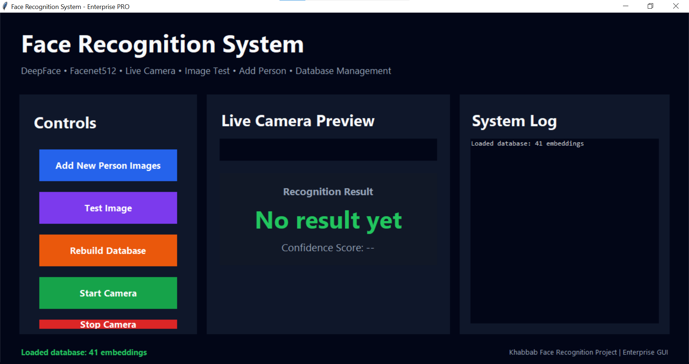
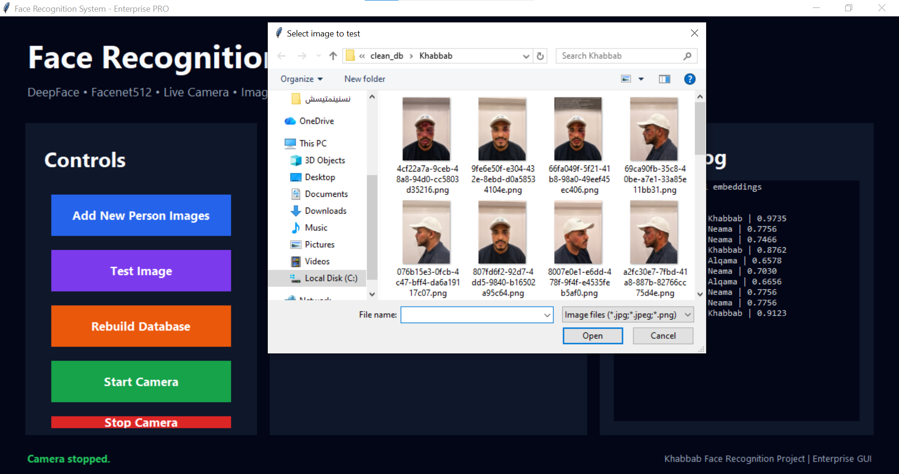
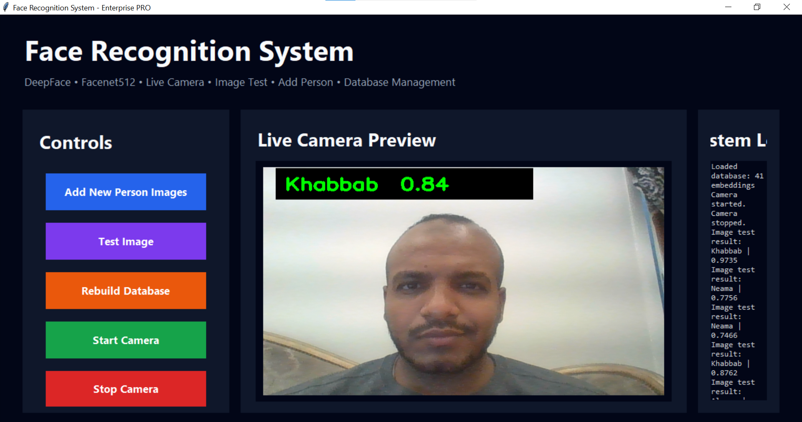
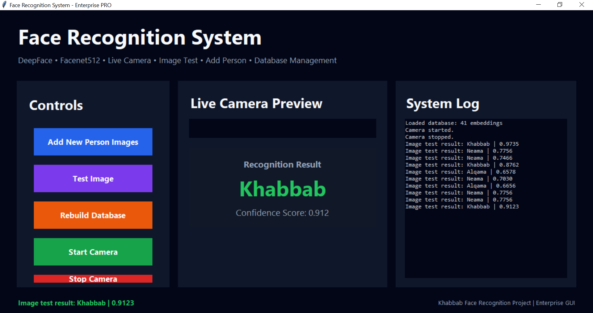

# AI Face Recognition System using DeepFace

## Overview
This project is an AI-powered Face Recognition System built using Python, DeepFace, Facenet512, and OpenCV.

The project supports:
- Real-time face recognition
- Image preprocessing
- Similarity matching
- Distorted image handling
- Live camera detection
- Face embeddings database management

## Project Screenshots

### Main GUI


### Image Recognition Test


### Live Recognition


### Recognition Results


## Key Features
- Professional desktop GUI
- Live camera face recognition
- Image-based face testing
- Add new person images
- Face embeddings database management
- Confidence score display
- Unknown face detection
- Facenet512 embedding model
- Real-time webcam processing
- AI-powered similarity matching

## Technologies Used
- Python
- DeepFace
- OpenCV
- Facenet512
- TensorFlow
- NumPy
- Tkinter
- PIL (Pillow)

## Features
- Face embeddings generation
- Real-time webcam recognition
- Database matching pipeline
- Unknown face threshold detection
- Image enhancement preprocessing
- GUI-based interaction
- Live recognition display
- Multiple person image support

## Environment Setup

Conda environment used for the project:

```bash
conda activate face-partial
```

## How to Run

```bash
cd C:\Users\LENOVO\face_partial_project\src
python 11_gui_full_pro.py
```

## Future Improvements
- Advanced GUI enhancements
- Injury simulation pipeline
- AI image restoration
- Cloud deployment using Azure
- Docker container deployment
- Multi-camera support
- Web-based interface

## Author
Khabbab Mujtaba Abdallah

## GitHub
GitHub Repository:
https://github.com/Khebooo911/face-recognition-deepface
